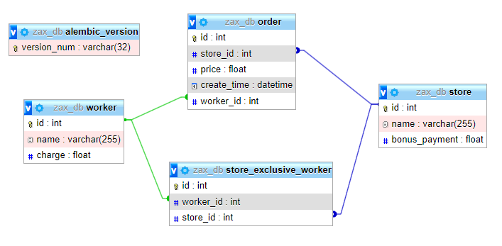

# Zax - Teste para Desenvolvedor Python

Projeto desenvolvido para a vaga de desenvolvedor Python Pleno na Zax.

### Descrição
O projeto visa realizar a coleta dos pedidos de uma loja por um motoboy. 

A coleta pode ser feita por um motoboy aleatório, mas dando preferencia para os motoboys que tenham exclusividade na loja que será realizada a coleta, ou pode ser feita por um motoboy especifico informado na solicitação de atendimento.

### Mapeamento do Banco de dados



### Executando o projeto

Na raiz do projeto execute o comando docker:

```bash
docker-compose up
```

Ao executar o comando ele irá subir os containers do MySQL e do Python, além de executar as migrations para criar as tabelas e popular as mesmas com os dados necessários.

#### Swagger

[http://localhost:5000/apidoc/swagger#/](http://localhost:5000/apidoc/swagger#/)

#### Endpoints

- Busca todos os entregadores cadastrados:
  - Acesse a API GET: [http://localhost:5000/worker/](http://localhost:5000/worker/)

- Faz um entregador <b>aleatório</b> pegar um pedido de alguma loja:
  - Acesse a API GET: [http://localhost:5000/order/](http://localhost:5000/order/)

- Faz um entregador específico pegar um pedido de alguma loja:
  - Acesse a API GET: [http://localhost:5000/order/{codigo_entregador}](http://localhost:5000/order/{codigo_entregador})